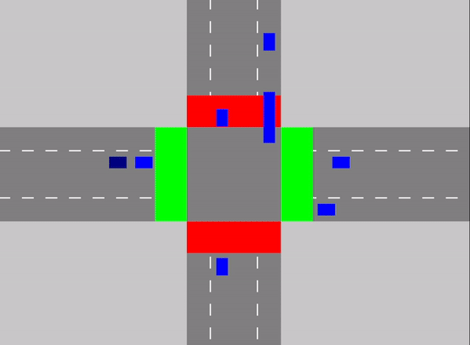

# 🚦 Traffic Queue Simulator

A real-time traffic simulation showcasing queue data structures & traffic management. Includes multiple vehicle types, traffic lights, and priority-based queue handling.



## ✨ Features

- 🏎️ Real-time 4-way intersection simulation
- 🚓🚑🚒 Multiple vehicle types with priority handling
- 🚦 Dynamic traffic light system
- 🔄 Vehicles can turn left, right, or go straight
- 🎯 Queue-based traffic management

## ⚙️ Prerequisites

You'll need:
- 🖥️ GCC/G++ compiler
- 🎮 SDL2 library
- 🏗️ MinGW (for Windows)

### 🛠 Installing SDL2

#### Windows Users:
1. 🔗 [Download SDL2](https://www.libsdl.org/download-2.0.php)
2. 📂 Extract contents to your project directory
3. 🏗 Create folders if missing:
   - `include/` (for headers)
   - `lib/` (for library files)
   - `bin/` (for output)

## 📂 Project Structure

```
DSA-Queue-Simulator/
├── include/          # Header files
├── lib/              # Library files
├── src/              # Source files
├── bin/              # Executables
└── README.md
```

## 🏗️ Building the Project

1. Clone the repo:
```bash
git clone https://github.com/zen4FR/dsa-queue-simulator.git
cd DSA-Queue-Simulator
```

2. Compile:
```bash
g++ -Iinclude -Llib -o bin/main.exe src/main.c src/traffic_simulation.c -lmingw32 -lSDL2main -lSDL2
```

```bash
g++ -o bin/generator src/generator.c src/traffic_simulation.c -lSDL2 -Iinclude -Llib -lmingw32 -lSDL2main -lSDL2
```

## ▶️ Running the Simulation

1. Start the vehicle generator:
```bash
./bin/generator
```
2. In another terminal, start the main simulation:
```bash
./bin/main
```
3. 🚗 Watch vehicles navigate the intersection!
4. ❌ Click the close button (X) to exit.

## 🚙 Vehicle Types
- 🔵 Regular cars
- 🔴 Ambulances
- 🔷 Police cars
- 🟠 Fire trucks

## 🏁 Traffic Management

- 🚦 **Queue System:** Each lane manages its own queue.
- 🚨 **Priority Handling:** Emergency vehicles go first.
- 🔄 **Traffic Light Cycles:** Automated red/green transitions.
- 🔁 **Turn Management:** Vehicles can turn left, right, or go straight.

## 📜 Code Highlights

### Queue Data Structure
```c
typedef struct Node {
    Vehicle vehicle;
    struct Node* next;
} Node;

typedef struct {
    Node* front;
    Node* rear;
    int size;
} Queue;
```

### Vehicle States
```c
typedef enum {
    STATE_MOVING,
    STATE_STOPPING,
    STATE_STOPPED,
    STATE_TURNING
} VehicleState;
```

## 🤝 Contributing

1. 🍴 Fork the repo
2. 🌿 Create a branch (`git checkout -b feature/AmazingFeature`)
3. 💾 Commit changes (`git commit -m 'Add AmazingFeature'`)
4. 🚀 Push (`git push origin feature/AmazingFeature`)
5. 🔥 Open a Pull Request

## 📚 References
- 📖 [SDL2 Documentation](https://wiki.libsdl.org/)
- 📘 CLRS: Queue Data Structures
- 🚗 Highway Capacity Manual (Traffic Flow Theory)

## 🙌 Acknowledgments
- ❤️ SDL2 Dev Team
- 🔬 Traffic Simulation Research Community
- 🎯 Contributors & Testers